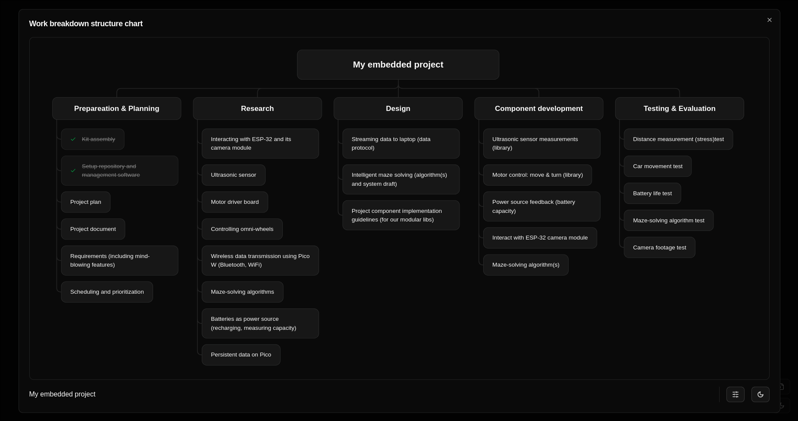
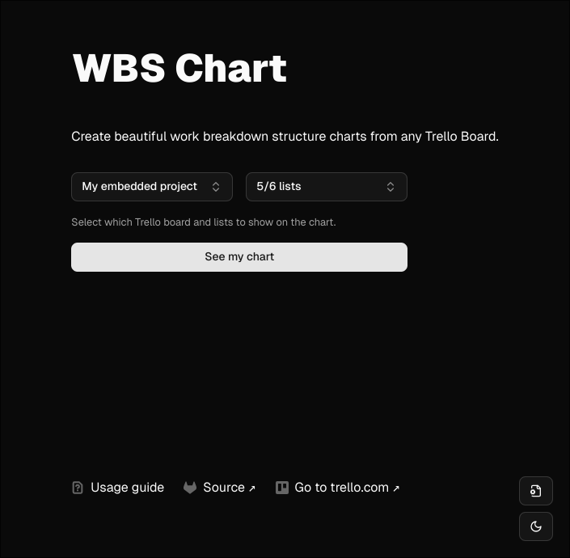
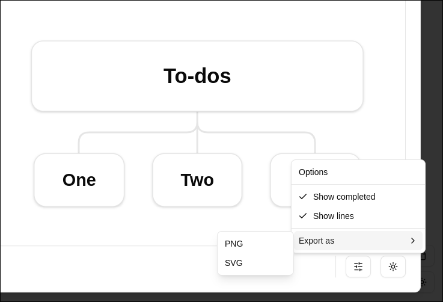
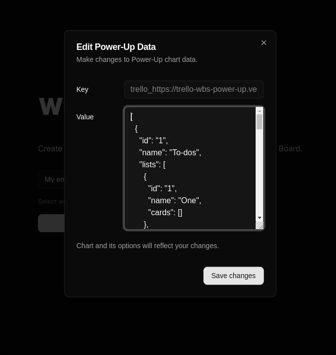

# WBS Power-up for Trello®


> **Create beautiful work breakdown structure charts from any Trello Board. [See the Power-up in action ↗](https://trello-wbs-power-up.vercel.app/).**



## Installation

Follow the [Trello's guide to add a custom Power-up to your board](https://developer.atlassian.com/cloud/trello/guides/power-ups/managing-power-ups/).
Use the following value for the connector URL:

```
https://trello-wbs-power-up.vercel.app/_trello
```

## Usage

Once the Power-up is installed, you should see a new icon appear in your
board's toolbar where buttons from other Power-ups reside. Clicking on the new
button will redirect you to [trello-wbs-power-up.vercel.app](https://trello-wbs-power-up.vercel.app/),
from where you can configure and see work breakdown structure charts.

1. Configuration involves selecting a board from which to pull cards for items on
the work breakdown structure chart. To get a board available for selection, you
must first press on the WBS Power-up icon in that board from inside Trello.



2. Next, select which lists to use cards from to build the chart, and press "See my chart".

3. From the chart dialog window, you can drag and zoom the chart content,
change the theme mode (dark/light) and customize appearance using the options
button in the lower right corner.

4. Click on the options button and navigate to the "Export as" submenu, from
where you can choose to export the chart in either PNG or SVG file formats.



## Advanced usage

Use the Data Tool button in the lower right cornet of the main Power-up page to
edit the JSON data used to build work breakdown structure charts. To clear the
data, enter `[]` into the value field.



## Security

WBS Power-up does not store any Trello board/cards data and does not issue
any authorization or data fetching requests to your Trello account or boards
you have access to. All the data required to create work breakdown structure
charts is gathered once you click on the Power-up in the toolbar with Power-up
buttons on a board inside Trello. This data is stored locally and is not
visible to the same Power-up running in a different browser or machine, even if
you are logged into the same Trello account.

## Issues and suggestions

To file an issue or request a feature, use the [Issues](https://gitlab.com/KirilStrezikozin/trello-wbs-power-up/-/issues)
tab of this repository.

## Development

Power-up is built with NextJS and React. To start a development server, run:

```bash
npm run dev
# or
yarn dev
# or
pnpm dev
# or
bun dev
```

Open [http://localhost:3000](http://localhost:3000) with your browser to see the result.

You can use the advanced Data Tool to enter custom JSON data to build WBS charts from.

## License

This project is not affiliated, associated, authorized, endorsed by or in any
way officially connected to Trello, Inc. ([www.trello.com](www.trello.com)).

Licensed under the MIT license. Copyright © 2025 Kiril Strezikozin. See [LICENSE](LICENSE).
